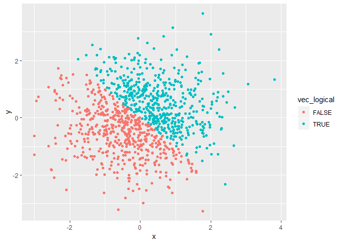
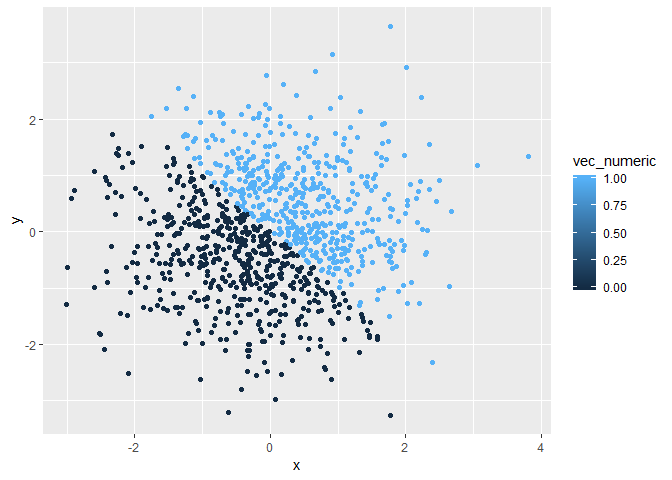
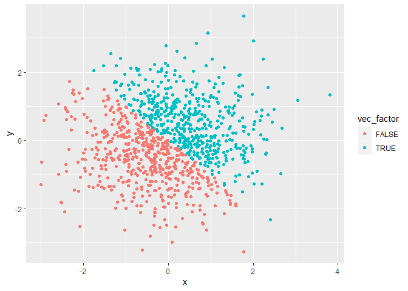

Homework 1
================

Problem 1
=========

This problem focuses on variable types and coercion.
----------------------------------------------------

First I create a data frame comprised of:

A random sample of size 10 from a uniform\[0, 5\] distribution

A logical vector indicating whether elements of the sample are greater than 2

A (length-10) character vector

A (length-10) factor vector

``` r
coercion_df = tibble(
  vec_unif = runif(10, min = 0, max = 5),
  vec_logical = vec_unif > 2,
  vec_char = c("My", "name", "is", "Yueming", "Kou", "and", "I", "love", "Data", 
               "Science"),
  vec_factor = factor(c("white", "black", "red", "orange", "yellow", "green", "blue", 
                        "purple", "grey", "pink"))
)
```

The chunk below try to take the mean of each variable in coercion\_df

``` r
mean(coercion_df$vec_unif)
```

    ## [1] 2.21439

``` r
mean(coercion_df$vec_logical)
```

    ## [1] 0.5

``` r
mean(coercion_df$vec_char)
```

    ## Warning in mean.default(coercion_df$vec_char): argument is not numeric or
    ## logical: returning NA

    ## [1] NA

``` r
mean(coercion_df$vec_factor)
```

    ## Warning in mean.default(coercion_df$vec_factor): argument is not numeric or
    ## logical: returning NA

    ## [1] NA

The "mean()" function works for the random sample and the logical vector, but it doesn't work for the character vector and the factor vector. The reason is elements of the character vector and the factor vector are not numeric or logical.

The chunk below applies the "as.numeric" function to the logical, character, and factor variables.

``` r
as.numeric(coercion_df$vec_unif)
as.numeric(coercion_df$vec_logical)
as.numeric(coercion_df$vec_char)
```

    ## Warning: 强制改变过程中产生了NA

``` r
as.numeric(coercion_df$vec_factor)
```

Notice that NAs introduced by coercion when applying the "as.numeric" function to the character variables.

The chunk below converts the character variable from character to factor to numeric; similarly, converts the factor variable from factor to character to numeric.

``` r
char_to_factor = as.factor(coercion_df$vec_char)
char_to_factor
```

    ##  [1] My      name    is      Yueming Kou     and     I       love   
    ##  [9] Data    Science
    ## Levels: and Data I is Kou love My name Science Yueming

``` r
as.numeric(char_to_factor)
```

    ##  [1]  7  8  4 10  5  1  3  6  2  9

``` r
factor_to_char = as.character(coercion_df$vec_factor)
factor_to_char
```

    ##  [1] "white"  "black"  "red"    "orange" "yellow" "green"  "blue"  
    ##  [8] "purple" "grey"   "pink"

``` r
as.numeric(factor_to_char)
```

    ## Warning: 强制改变过程中产生了NA

    ##  [1] NA NA NA NA NA NA NA NA NA NA

Notice that NAs introduced by coercion when converting the factor variable from factor to charcter to numeric.

Problem 2
=========

This problem focuses on plotting and the use of inline R code.
--------------------------------------------------------------

First I create a data frame comprised of:

x: a random sample of size 1000 from a standard Normal distribution

y: a random sample of size 1000 from a standard Normal distribution

A logical vector indicating whether the x + y &gt; 0

A numeric vector created by coercing the above logical vector

A factor vector created by coercing the above logical vector

``` r
set.seed(1)

plot_df = tibble(
  x = rnorm(1000),
  y = rnorm(1000),
  vec_logical = x + y > 0,
  vec_numeric = as.numeric(vec_logical),
  vec_factor = as.factor(vec_logical)
)
```

First I write a short description of my vector using inline R code.

The size of the dataset is 1000, 5.

The mean of x is -0.0116481.

The median of x is -0.0353242.

The proportion of cases for which the logical vector is TRUE is 0.49.

The chunk below makes scatterplots of y vs x; exports the first scatterplot.

``` r
ggplot(plot_df, aes(x = x, y = y, color = vec_logical)) + geom_point()
```



``` r
ggsave("scatter_logical.pdf", height = 4, width = 6)
ggplot(plot_df, aes(x = x, y = y, color = vec_numeric)) + geom_point() 
```



``` r
ggplot(plot_df, aes(x = x, y = y, color = vec_factor)) + geom_point() 
```



Comment: In the first scatterplot, color points using the logical variable. When vec\_logical = "FALSE"", the color of the points are red, when vec\_logical = "TRUE", the color of the points are blue. In the second scatterplot, color points using the numeric variable. The color scale gradually changes from light blue to dark blue as the numeric change from 1 to 0. When vec\_numeric = 0, the color of the points are dark blue, when vec\_numeric = 1, the color of the points are light blue. In the third scatterplot, color points using the factor variable. When vec\_factor = FALSE, the color of the points are red, when vec\_factor = TRUE, the color of the points are blue. In all the three scatterplots, "x + y = 0" is the boundary between points with different colors.
